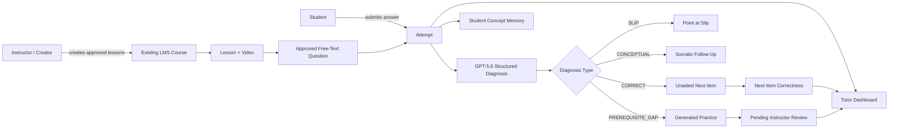
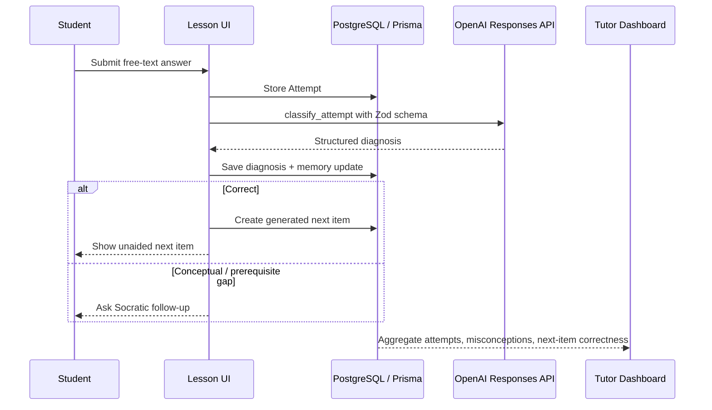
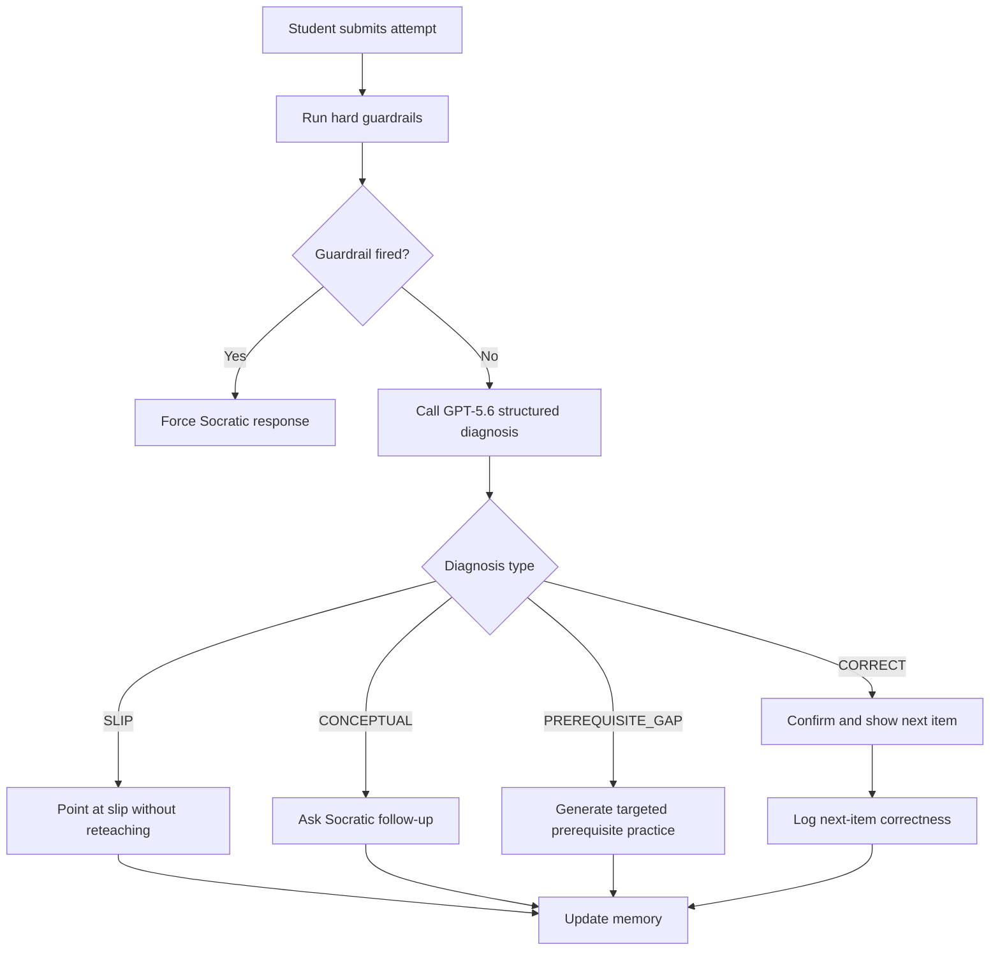

# Socratix

Socratix is a Socratic tutoring layer built on top of an existing LMS. The base platform already includes course creation, chapters, lessons, enrollment, authentication, payments, and creator/student dashboards. The hackathon work adds the AI tutoring loop: free-text attempts, structured diagnosis, Socratic follow-up, generated practice, next-item correctness, per-student memory, and instructor telemetry.

The demo subject is introductory inferential statistics, scoped to sampling distributions, standard error, confidence intervals, and p-value interpretation.

## Submission Summary

**Category:** Education

**Project description:** Socratix helps students practice difficult statistics concepts through Socratic tutoring instead of answer-revealing chat. Students submit free-text reasoning, GPT-5.6 classifies the attempt into a small set of pedagogical outcomes, the app branches in code, and instructors see misconception telemetry plus next-item correctness.

**Why it matters:** Multiple choice can tell an instructor that a student is wrong. Free text plus structured diagnosis can show why the student is wrong, whether the misconception transferred to the next item, and which concepts need instructor attention.

## What Was Built

The existing LMS provides the course shell. Socratix adds:

- Free-text questions attached to lessons
- Attempt logging with diagnosis stored as JSON
- GPT-5.6 Responses API structured diagnosis through Zod schemas
- Socratic follow-up prompts that avoid giving away answers
- Guardrails for answer extraction, out-of-syllabus topics, and method fidelity
- Generated next-item practice marked as pending instructor review
- Next-item correctness logging via `Attempt.isNextItem`
- Per-student concept memory
- Tutor dashboard for misconception telemetry and generated-practice review
- YouTube lesson support as instructor-attached material

## Architecture





## Tech Stack

| Layer | Technology |
| --- | --- |
| Framework | Next.js App Router |
| Language | TypeScript |
| ORM | Prisma |
| Database | PostgreSQL / Neon |
| Styling | Tailwind CSS + shadcn/ui |
| Auth | BetterAuth |
| Payments | Stripe |
| Security | Arcjet |
| AI | OpenAI Responses API, GPT-5.6, Zod Structured Outputs |
| Package manager | pnpm |

## AI Design

The tutoring loop is controlled in application code, not by an autonomous agent.



The model returns a structured `classify_attempt` object:

```ts
{
  type: "CORRECT" | "SLIP" | "CONCEPTUAL" | "PREREQUISITE_GAP";
  misconception: string | null;
  prerequisite_missing: string | null;
  confidence: number;
  student_facing_move:
    | "SOCRATIC_QUESTION"
    | "POINT_AT_SLIP"
    | "GENERATE_PRACTICE"
    | "ADVANCE";
  student_facing_response: string;
}
```

If `OPENAI_API_KEY` is unavailable or the model call fails, the app falls back to deterministic demo-safe diagnosis so the live walkthrough remains stable.

## How GPT-5.6 Is Used

Socratix uses GPT-5.6 through the OpenAI Responses API for two runtime tasks:

1. **Structured attempt diagnosis:** the model receives the lesson, concept, reference answer, student answer, instructor method note, and memory context. It returns a Zod-validated `classify_attempt` object.
2. **Generated practice:** after a correct or remediated attempt, the app can generate a new free-text next item for the same concept. Generated practice is immediately visible to the student but marked `PENDING_INSTRUCTOR_REVIEW`.

The app does not let the model run freely. Application code handles the branch:

```text
CORRECT -> show next item
SLIP -> point at the slip
CONCEPTUAL -> ask Socratic follow-up
PREREQUISITE_GAP -> generate prerequisite practice
```

Hard guardrails run before or after model output so answer-extraction attempts such as "just tell me the answer" force a Socratic question.

## How Codex Was Used

Codex was used as the primary implementation partner for the hackathon extension:

- reading the existing LMS structure and preserving course, enrollment, auth, payment, and dashboard behavior
- designing the Socratix workplan from `architecture.md`
- adding Prisma migrations for concepts, questions, attempts, memory, approval metadata, and YouTube lesson URLs
- wiring Server Actions, lesson UI, tutor dashboard, and seed scripts
- integrating the OpenAI Responses API with Zod Structured Outputs
- adding guardrails, next-item logging, and instructor review markers
- repeatedly running `pnpm build`, Prisma validation, TypeScript checks, and migration status checks

This distinction matters because the LMS predates the hackathon; the Socratix tutoring layer is the new Codex/GPT-5.6 work.

## Demo Flow

The recommended 3-minute walkthrough is documented in [demo-script.md](./demo-script.md).

High-level path:

1. Open the enrolled Inferential Statistics course as a student.
2. Submit an incomplete answer on The Sampling Distribution.
3. Show the Socratic follow-up and corrected reply.
4. Show the unaided next item and next-item logging.
5. Submit the classic p-value misconception on Hypothesis Testing.
6. Open `/admin/tutor` and show misconception telemetry, generated practice review, and next-item correctness.

## Judge Testing Notes

Recommended path for judges:

1. Start the app and sign in with a seeded or manually created student account.
2. Enroll the student in the Inferential Statistics course if needed.
3. Open the Sampling Distribution lesson and submit an incomplete answer.
4. Reply to the Socratic follow-up and submit the next item.
5. Open Hypothesis Testing and submit the p-value misconception.
6. Sign in as a creator and open `/admin/tutor`.

If a hosted demo instance is provided in the submission form, use that first. Local setup is available below for repository judging.

## Local Setup

Install dependencies:

```bash
pnpm install
```

Create an environment file:

```bash
cp .env.example .env
```

Required variables include:

```bash
DATABASE_URL=
BETTER_AUTH_SECRET=
BETTER_AUTH_URL=
AUTH_GITHUB_CLIENT_ID=
AUTH_GITHUB_SECRET=
AWS_ACCESS_KEY_ID=
AWS_SECRET_ACCESS_KEY=
AWS_ENDPOINT_URL_S3=
AWS_REGION=
NEXT_PUBLIC_S3_BUCKET_NAME=
ARCJET_KEY=
STRIPE_SECRET_KEY=
STRIPE_WEBHOOK_SECRET=
OPENAI_API_KEY=
OPENAI_MODEL=gpt-5.6-terra
```

Apply migrations and generate the Prisma client:

```bash
pnpm prisma migrate deploy
pnpm prisma generate
```

Seed the demo concepts and questions:

```bash
node scripts/seed-socrates-demo.cjs
```

Run the app:

```bash
pnpm dev
```

## Verification

```bash
pnpm prisma validate
pnpm exec tsc --noEmit
pnpm build
pnpm prisma migrate status
```

## Key Routes

| Route | Purpose |
| --- | --- |
| `/dashboard/enrolled-courses` | Student enrolled courses |
| `/dashboard/enrolled-courses/[slug]/[lessonId]` | Lesson player with Socratic question surface |
| `/admin/courses` | Existing creator course dashboard |
| `/admin/courses/[courseId]/edit` | Existing course/chapter/lesson editor |
| `/admin/tutor` | Socratix tutor dashboard |

## Project Structure

```text
src/
  app/
    admin/
      tutor/                         Tutor dashboard route
      actions/getTutorDashboard.ts   Tutor telemetry query
    dashboard/
      _components/socratesQuestion.tsx
      actions/submit-attempt.ts
  lib/
    socrates-ai.ts                   OpenAI Responses API + Zod schemas
    youtube.ts                       YouTube URL parsing helpers
  generated/prisma/                  Generated Prisma client
prisma/
  schema.prisma
  migrations/
scripts/
  seed-socrates-demo.cjs
demo-script.md
workplan.md
architecture.md
```

## Hackathon Scope Note

The LMS predates the hackathon. The Socratix tutoring layer was added as the meaningful extension:

- Prisma schema additions for concepts, questions, attempts, memory, and approval metadata
- Student attempt and Socratic tutoring UI
- GPT-5.6 structured diagnosis integration
- Guardrails and generated practice
- Instructor-facing tutor dashboard

For the demo, the YouTube video is supporting lesson material. The source of truth is instructor-approved lesson context and questions; the app does not claim that GPT watched or learned directly from the video.
